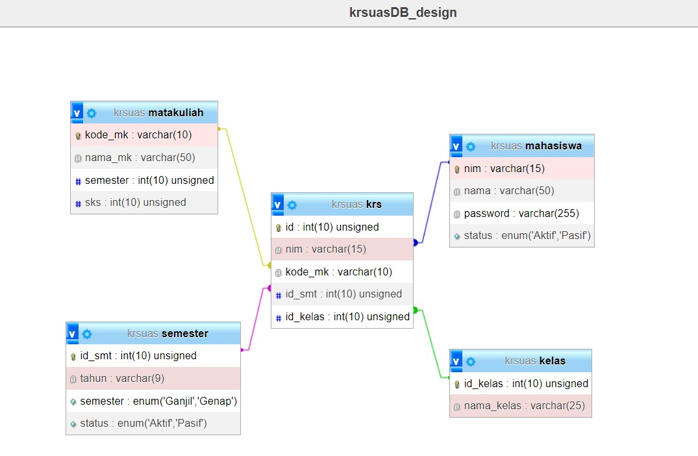

# KRS_UAS

Aplikasi yang diperuntukan untuk mahasiswa yang ingin mengambil matakuliah.

## Disclaimer

Aplikasi ini dibuat untuk memenuhi tugas akhir(UAS) matakuliah web programming saya berdasarkan [soal](SOAL_UAS.pdf) yang diberikan, jadi tidak seperti real use case pengambilan krs pada aplikasi kampus😁

## Documentation

#### Database design :

atau bisa langsung import DBnya [disini](docs/krsuas.sql)

#### Akun Aktif :
* 👤NIM : 220101234 
* 🔑PW : dummy333
#### Akun Pasif :
* 👤 NIM : 220101113
* 🔑PW : dummy222
## Lainnya
👩‍💻 Saat ini saya sedang mengerjakan [Greed](https://github.com/Rettorio/Greed) sebuah php framework dengan arsitektur mvc. Feel free to drop by👋
